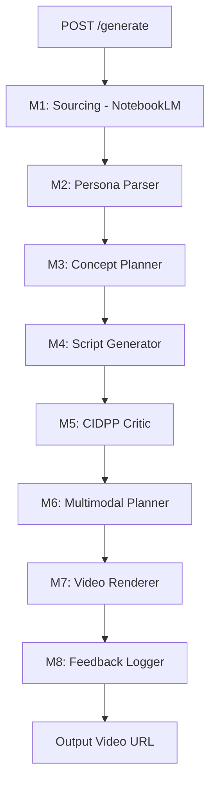
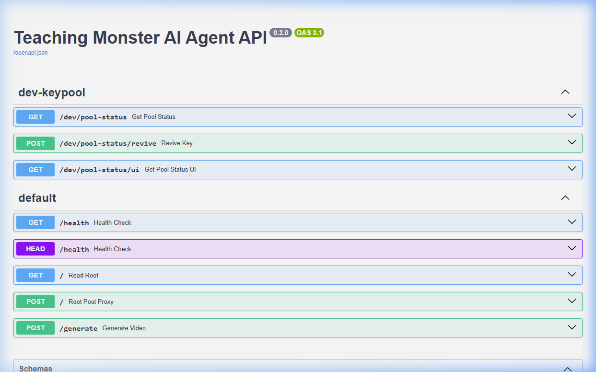

# 🎮 Teaching Monster AI Agent (v0.3.0)

> [!IMPORTANT]
> **🤖 FOR AI AGENTS / ASSISTANTS**
> Before taking any action, you MUST read **[ONBOARDING.md](file:///d:/My_Projects/TeachingMonsterAI/ONBOARDING.md)**. Use the `project_onboarding_check` skill to align with our pedagogical mission and 8-stage pipeline architecture.

---


[](https://teaching.monster)
[](https://github.com/artcenter/TeachingMonsterAI)
[](https://www.docker.com/)

An autonomous pedagogical video generation system built for the **Teaching Monster Challenge**. This agent receives a topic and a student persona, then delivers a high-quality, grounded educational video in under 30 minutes with zero human intervention.

---

## 🌟 Key Features

- **Autonomous M1-M8 Pipeline**: From sourcing facts via NotebookLM to final FFmpeg rendering.
- **Pedagogical Intelligence**: Implements scaffolding strategies, misconception detection, and cognitive load optimization.
- **Gemini 2.0 Flash Integration**: High-speed, high-context reasoning for script generation and multimodal planning.
- **Neural TTS**: High-fidelity narration via Cartesia.
- **Docker-First Architecture**: Guaranteed reproducibility across any environment.

---

## 🏗️ System Architecture

The agent operates as a fully automated eight-stage pipeline, orchestrated by `main.py`.



| Module | Name | Responsibility |
| :--- | :--- | :--- |
| **M1** | **Sourcing** | Extract grounded facts from NotebookLM & Web Search. |
| **M2** | **Persona Parser** | Infer learner state and ZPD (Zone of Proximal Development). |
| **M3** | **Concept Planner** | Sequence concepts into an optimal lesson arc. |
| **M4** | **Scriptwriter** | Generate pedagogical narration with visual cues. |
| **M5** | **Critic** | Score scripts on Accuracy, Logic, and Engagement. |
| **M6** | **MM Planner** | Map script segments to optimal visual representations. |
| **M7** | **Renderer** | Assemble TTS + visuals via FFmpeg into the final MP4. |
| **M8** | **Logger** | Record persistent errors and training signals. |
| **DASH** | **Mission Control** | Real-time observability and key quota management. |

---

## 🔍 Observability & Inspection

The system includes dedicated tools for monitoring pipeline health and API utilization in real-time.

### 🗝️ KeyRotator Dashboard (Mission Control)
### 📊 KeyRotator Dashboard
Real-time pool health, rate-limit tracking, and pipeline activity logging.

- **Access**: [http://localhost:8000/dev/pool-status/ui](http://localhost:8000/dev/pool-status/ui)
- **Features**:
    - **Live Public URL**: Automatically detects the current ngrok endpoint.
    - **Activity Log**: Tracks successes, 429 rate limits, and pool exhaustion events.
    - **Pulse Test**: Trigger a "heartbeat" to verify end-to-end connectivity.


### 📚 API Documentation (Swagger)
Interactive API playground with automatic schema validation.

- **Access**: [http://localhost:8000/docs](http://localhost:8000/docs)
- **Usage**: Test the `POST /generate` endpoint with custom requirements.




---

## 🚀 Quick Start (Docker)

The fastest way to get the agent running is via Docker Compose.

### 1. Prerequisites
- Docker & Docker Compose installed.
- API Keys for: Google Gemini, Cartesia, and (optional) ngrok.

### 2. Configure Environment
Copy `.env.example` to `.env` (or update existing) and fill in your keys:
```bash
GOOGLE_API_KEY=your_key
CARTESIA_API_KEY=your_key
NGROK_AUTHTOKEN=your_token (optional for public tunnel)
```

### 3. Start the Pipeline
```bash
docker compose up -d --build
```
The API will be available at `http://localhost:8000`.

### 4. Trigger a Generation
```bash
curl -X POST http://localhost:8000/generate \
     -H "Content-Type: application/json" \
     -d '{"course_requirement": "Quantum Tunneling", "student_persona": "12-year old curios learner"}'
```

---

## 🏆 Pre-Contest Submission Procedure v1.0

Follow this step-by-step guide right before submitting your final model for contest. This ensures fresh authentication, optimized performance, and reliable API access.

### Step 1: Re-Authenticate NotebookLM (5-10 minutes)
**Why**: NotebookLM sessions expire ~2 weeks; fresh auth enables grounded sourcing during contest.

1. **On host machine** (not in container):
   - Open PowerShell/Command Prompt
   - Run: `notebooklm login`
   - Browser opens → Sign in with Google account linked to NotebookLM
   - Wait for "Login successful" message

2. **Extract new auth JSON**:
   - Navigate to: `%USERPROFILE%\.notebooklm\profiles\default\storage_state.json`
   - Open file, copy entire JSON content (single line, no formatting)

3. **Update .env**:
   - Open `D:\My_Projects\TeachingMonsterAI\.env`
   - Replace `NOTEBOOKLM_AUTH_JSON=` with the copied JSON
   - Save file

4. **Restart container**:
   - Run: `docker restart teaching-monster-app`
   - Wait 30 seconds for container to fully start

5. **Verify auth**:
   - Run test: `docker exec teaching-monster-app python test_notebooklm.py`
   - Should succeed without "Authentication expired" error

### Step 2: Replace with High-Performance API Keys (10-15 minutes)
**Why**: Free-tier keys have rate limits; paid keys enable CONTEST_MODE parallel processing and higher quotas.

**Checklist for Key Replacement**:

- [ ] **Backup current .env**: Copy to `env.backup` (never commit)
- [ ] **Obtain high-performance keys**:
  - Google Gemini: Upgrade to paid tier at [Google AI Studio](https://aistudio.google.com/app/apikey) (minimum $10/month for higher limits)
  - OpenRouter: Upgrade account for higher rate limits
  - Cartesia: Ensure paid tier for TTS
- [ ] **Update primary keys**:
  - Replace `GOOGLE_API_KEY` with paid key
  - Replace `OPENROUTER_API_KEY` with paid key
  - Keep `CARTESIA_API_KEY` if already paid
- [ ] **Update key pools** (use keyrotator for rotation):
  - Run: `python keyrotator/router.py --update-google-pool --keys "key1,key2,key3"` (replace with actual keys)
  - Run: `python keyrotator/router.py --update-openrouter-pool --keys "key1,key2,key3"`
  - Check `modules/key_pool_state.py` for pool status
- [ ] **Test key rotation**:
  - Run: `python scratch/test_keys.py`
  - Ensure no "quota exceeded" errors
- [ ] **Enable contest mode**:
  - Set `CONTEST_MODE=true` in .env
  - Restart container: `docker restart teaching-monster-app`
- [ ] **Verify ngrok**:
  - Check ngrok status: Visit http://localhost:4040
  - Ensure domain `lively-living-crane.ngrok-free.app` is active
  - Test endpoint: `curl http://lively-living-crane.ngrok-free.app/health`

### Step 3: Final Pipeline Test (5-10 minutes)
1. **Run full pipeline test**:
   - `docker exec teaching-monster-app python test_pipeline.py` (if exists) or trigger via API
   - Verify generation completes in <300 seconds with parallel processing

2. **Check logs**:
   - `docker logs teaching-monster-app --tail 50`
   - Ensure no auth errors, key exhaustion, or FFmpeg issues

3. **Confirm improvements active**:
   - M3: Generates 3+ nodes
   - M5: Synthetic students find issues (not "perfect")
   - NotebookLM: Uses grounded facts (check citations)

### Emergency Checklist (If Issues Arise)
- [ ] Disable NotebookLM: Remove `NOTEBOOKLM_AUTH_JSON` → falls back to web search
- [ ] Switch to stdio MCP: Set `OPENSPACE_MCP_URL=http://host.docker.internal:8081/mcp` if streamable fails
- [ ] Increase timeouts: Edit `modules/m1_sourcing.py` timeout to 120s
- [ ] Clear cache: `docker system prune -a` (rebuilds fresh images)

**Time Estimate**: 20-35 minutes total. Perform 1-2 hours before contest deadline to allow testing. Never commit real keys to git.

---

## 🛠️ Maintenance & Cleanup

The pipeline generates temporary image sequences and large Docker images. To keep your workspace clean:

- **Clean Temporary Files**: `Remove-Item -Path temp -Include *.png,*.raw -Recurse -Force`
- **Prune Old Images**: `docker image prune` (or follow instructions in [ONBOARDING.md](file:///d:/My_Projects/TeachingMonsterAI/ONBOARDING.md#6-maintenance--workspace-cleanup)).

---

## 📚 Documentation
- [**ONBOARDING.md**](file:///d:/My_Projects/TeachingMonsterAI/ONBOARDING.md): Detailed technical guide for developers.
- [**README-docker.md**](file:///d:/My_Projects/TeachingMonsterAI/README-docker.md): Granular Docker and ngrok networking setup.
- [**PHASE_4_PLAN.md**](file:///d:/My_Projects/TeachingMonsterAI/PHASE_4_PLAN.md): Roadmap for future pedagogical improvements.
- [**Mission Control**](http://localhost:8000/dev/pool-status/ui): Live Dashboard.
- [**API Docs**](http://localhost:8000/docs): Interactive API Documentation.

---
*Developed by Antigravity AI Agent for the Teaching Monster Challenge — April 2026*
