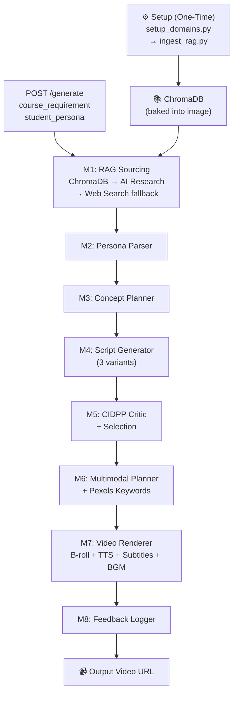

# 🎓 Teaching Monster AI Agent (v0.6.0 — RLT Edition)

> [!IMPORTANT]
> **🤖 FOR AI AGENTS / ASSISTANTS**
> Before taking any action, you MUST read **[ONBOARDING.md](./ONBOARDING.md)**. Understand the 8-module pipeline, current branch (`RAG`), and v2.0 architecture changes before touching any code.

---

[](https://teaching.monster)
[](https://github.com/ArtCenter1/TeachingMonsterAI)
[](https://github.com/ArtCenter1/TeachingMonsterAI/tree/RAG)
[](https://www.docker.com/)

An autonomous pedagogical video generation system built for the **Teaching Monster Challenge**. The agent receives a topic and a student persona, then delivers a high-quality, grounded educational video in under 30 minutes — with zero human intervention.

**v0.6.0 introduces stabilized NotebookLM authentication, Phase 4-B "RLT-Style" Reward Signals, and global version synchronization.**

---

## 🌟 What's New in v0.6.0 (RLT Phase)

| Feature | v0.5.1 | v0.6.0 |
| :--- | :--- | :--- |
| **Fact Sourcing** | NotebookLM (fragile, cookie-auth) | ✅ Local ChromaDB RAG — offline, sub-2s |
| **Video Backgrounds** | Static PNG slides | ✅ Pexels B-roll video clips |
| **Subtitles** | Raw FFmpeg drawtext | ✅ Karaoke-style, white + black stroke |
| **Background Music** | None | ✅ Royalty-free BGM, auto-looped |
| **Subject Domains** | Hardcoded (Physics, Bio, CS, Math) | ✅ Configurable — any subject |
| **External Dependencies** | NotebookLM + OpenSpace MCP | ✅ Fully offline (API keys only) |
| **Docker Image Size** | ~1.8GB (CUDA torch) | ✅ ~450MB (CPU-only torch) |

---

## 🏗️ System Architecture



### Module Reference

| Module | Name | Responsibility |
| :--- | :--- | :--- |
| **M1** | **RAG Sourcing** | Query local ChromaDB → AI Research → Web Search fallback |
| **M2** | **Persona Parser** | Infer learner state, ZPD, and validate request is within configured domains |
| **M3** | **Concept Planner** | Build prerequisite dependency graph; sequence optimal lesson arc |
| **M4** | **Script Generator** | Generate 3 pedagogical script variants with scaffolding + visual cues |
| **M5** | **CIDPP Critic** | Score on 5 dimensions; select best variant; trigger revision if needed |
| **M6** | **MM Planner** | Map segments to visual type + generate Pexels B-roll search keywords |
| **M7** | **Video Renderer** | Assemble Pexels B-roll + Cartesia TTS + karaoke subtitles + BGM into MP4 |
| **M8** | **Feedback Logger** | Record all run data for reward model training and strategy tracking |

---

## 🚀 Quick Start

### Prerequisites
- Docker & Docker Compose
- API Keys: Google Gemini, Cartesia, Pexels

### Step 1 — Configure Environment
```bash
cp .env.example .env
# Edit .env and fill in your keys
```

Required keys:
```bash
GOOGLE_API_KEY=your_gemini_key
CARTESIA_API_KEY=your_cartesia_key
PEXELS_API_KEY=your_pexels_key
```

### Step 2 — Configure Subject Domains
This is the **one-time setup** that determines what subjects the system knows.

**Option A — Interactive wizard (recommended):**
```bash
python scripts/setup_domains.py
```
Follow the prompts to add, remove, or replace subject domains. The wizard calls ingestion automatically when done.

**Option B — Edit YAML directly:**
```bash
# Edit config/domains.yaml with your subjects and topics
# Then run ingestion:
python scripts/ingest_rag.py
```

**For the Teaching Monster Competition** — the defaults in `config/domains.yaml` are already set to Physics, Biology, Computer Science, and Mathematics. You can skip this step and go straight to Step 3.

### Step 3 — Build & Run
```bash
docker compose up -d --build
```
The `docker build` automatically:
- Installs CPU-only PyTorch (~250MB, no CUDA bloat)
- Downloads the embedding model (`all-MiniLM-L6-v2`, ~90MB)
- Runs `ingest_rag.py` to bake the knowledge corpus into the image

### Step 4 — Generate a Video
```bash
curl -X POST http://localhost:8000/generate \
     -H "Content-Type: application/json" \
     -d '{"course_requirement": "Newton'\''s Laws of Motion", "student_persona": "High schooler, visual learner, no calculus"}'
```

Response:
```json
{
  "video_url": "https://cdn.../your-video.mp4",
  "supplementary_url": "https://cdn.../study-guide.html",
  "generation_time_seconds": 1291
}
```

---

## ⚙️ Configuring Subject Domains

The system is designed to work with **any subject domain**, not just the competition defaults.

### domains.yaml Structure
```yaml
# config/domains.yaml
domains:
  - name: "AP Physics"
    level: "secondary"        # primary | secondary | university
    topics:
      - "Mechanics and Newton's Laws"
      - "Electricity and Magnetism"

  - name: "Elementary Music"
    level: "primary"
    topics:
      - "Rhythm and Beat"
      - "Reading Sheet Music"
```

### How Curriculum Content is Generated
- If `resources/curriculum/<domain>/<topic>.md` **exists** → the file is used directly
- If the file **doesn't exist** → the LLM auto-generates a ~1,500-word curriculum summary for that topic
- All content is embedded and stored in ChromaDB at `temp/chroma_db/`

This means you can deploy this system for **elementary music, language arts, history, coding bootcamps** — any subject — just by editing `domains.yaml` and rebuilding.

---

## 🎬 How the Video Pipeline Works

For each API call, the pipeline runs in ~21 minutes:

| Stage | What Happens | Time |
|---|---|---|
| M1 RAG | ChromaDB returns grounded facts for the topic | ~2s |
| M2 Persona | Parses student level, learning style, ZPD | ~5s |
| M3 Planner | Builds concept sequence + prerequisite graph | ~15s |
| M4 Script | Generates 3 script variants in parallel | ~3m |
| M5 Critic | CIDPP scores → selects best variant | ~2m |
| M6 Visuals | Maps segments to Pexels search keywords | ~20s |
| M7 Render | B-roll download + TTS + subtitles + BGM + concat | ~15m |
| M8 Log | Saves run record for reward model | ~1s |

---

## 🔍 Observability

### API Documentation (Swagger)
Interactive API playground with automatic schema validation.

- **Access**: [http://localhost:8000/docs](http://localhost:8000/docs)

### KeyRotator Dashboard (Mission Control)
Real-time API key health, rate-limit tracking, and pipeline activity.

- **Access**: [http://localhost:8000/dev/pool-status/ui](http://localhost:8000/dev/pool-status/ui)

---

## 📐 Model Assignment by Module

| Module | Recommended Model | Rationale |
|---|---|---|
| **M1 Sourcing** | `gemini-1.5-flash` | AI Research fallback only; simple fact extraction |
| **M2 Persona Parser** | `gemini-1.0-pro` | Basic JSON extraction |
| **M3 Concept Planner** | `gemini-1.5-pro` | Pedagogical sequencing requires reasoning |
| **M4 Script Generator** | `gemini-2.0-flash` | Complex multi-step generation × 3 variants |
| **M5 Critic** | `gemini-1.5-pro` | CIDPP 5-dimension scoring + feedback |
| **M6 MM Planner** | `gemini-1.5-flash` | Keyword & spec generation |
| **M7 Renderer** | N/A | No LLM — pure moviepy + FFmpeg |
| **M8 Logger** | N/A | No LLM — pure I/O |

Configure in `.env`:
```bash
PRIMARY_MODEL=models/gemini-2.0-flash
FALLBACK_MODEL=models/gemini-1.5-flash
```

---

## 🏆 Pre-Contest Checklist (v2.0)

Replace the v1.0 NotebookLM re-auth flow with this:

- [ ] **Verify domain corpus**: Run `python scripts/ingest_rag.py` — confirm all 4 subjects ingested
- [ ] **Test RAG offline**: Disconnect internet → verify pipeline still sources facts via ChromaDB
- [ ] **Upgrade to paid API keys**: Google Gemini, Cartesia, Pexels (check rate limits)
- [ ] **Enable contest mode**: Set `CONTEST_MODE=true` in `.env`
- [ ] **Full end-to-end test**: `curl` the `/generate` endpoint; verify video URL returns in < 25 minutes
- [ ] **Check logs**: `docker logs teaching-monster-app --tail 50` — no auth errors

> **Removed from v1.0:** NotebookLM re-authentication is no longer required. The system is fully offline for sourcing.

---

## 🛠️ Maintenance & Cleanup

```bash
# Clean temporary video and audio files
Remove-Item -Path temp -Include *.mp4,*.raw,*.png -Recurse -Force

# Clear ChromaDB (forces re-ingestion on next build)
Remove-Item -Path temp/chroma_db -Recurse -Force

# Clear Pexels video cache
Remove-Item -Path temp/cache_videos -Recurse -Force

# Prune Docker images
docker image prune
```

---

## 📚 Documentation

- [**ONBOARDING.md**](./ONBOARDING.md) — Technical guide for new developers and AI agents
- [**Teaching_Monster_AI_Agent_PRD_v2.0.md**](./Teaching_Monster_AI_Agent_PRD_v2.0.md) — Full product requirements document
- [**config/domains.yaml**](./config/domains.yaml) — Subject domain configuration
- [**API Docs**](http://localhost:8000/docs) — Interactive API Documentation (when running)

---

*Developed for the Teaching Monster Challenge — April 2026*
*v2.0 RAG Branch — Local-first, visually enhanced, domain-configurable*
